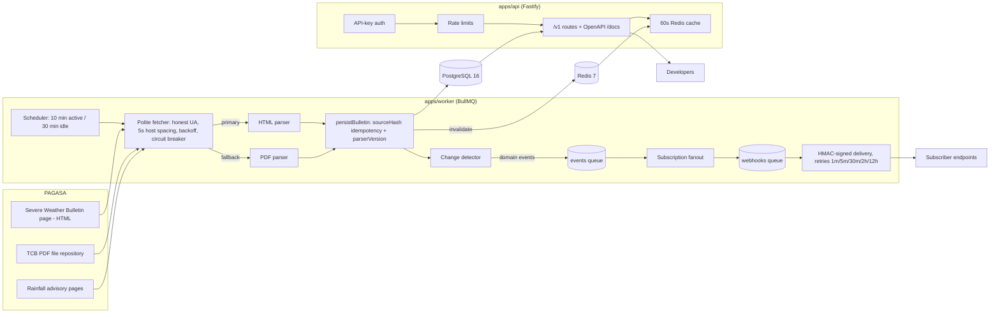

# BagyoAPI 🌀

**PAGASA tropical cyclone bulletins as a clean, structured REST API** — wind signals,
cyclone tracks, and rainfall advisories, normalized into JSON with PSGC location codes,
webhooks, API keys, and tiered rate limits. There is no official PAGASA developer API;
BagyoAPI fills that gap.

> **Disclaimer:** BagyoAPI is an independent service, not affiliated with or endorsed by
> PAGASA/DOST. Data is derived from public DOST-PAGASA bulletins and may lag or contain
> parsing errors. **Never** use it as the sole source for life-safety decisions — always
> defer to official PAGASA channels. Every API response carries this disclaimer and a
> `"source": "DOST-PAGASA"` attribution.

## Quickstart (under 2 minutes)

```bash
docker compose up -d --build     # Postgres 16 + Redis 7 + migrate + seed + API + worker
```

The `seed` service loads six **real PAGASA bulletins** (Typhoon INDAY, Typhoon FRANCISCO,
TD JOSIE — 2026 season) through the actual parser, so the API is fully demo-able with zero
live scraping, and prints a demo PRO API key:

```bash
export BAGYO_API_KEY=bgy_live_demo0000000000000000000000000000

# What's active right now?
curl -s http://localhost:3000/v1/cyclones/active -H "Authorization: Bearer $BAGYO_API_KEY" | jq .

# The money endpoint — current wind signal for any Philippine location:
curl -s "http://localhost:3000/v1/signals/lookup?q=Batanes" \
  -H "Authorization: Bearer $BAGYO_API_KEY" | jq .data.signal
```

Interactive OpenAPI docs: **http://localhost:3000/docs**

### Local development (without Docker images)

```bash
pnpm install
docker compose up -d postgres redis   # or any local Postgres 16+/Redis 7
cp .env.example .env
pnpm db:migrate && pnpm build && pnpm db:seed
pnpm dev:api      # Fastify with hot reload on :3000
pnpm dev:worker   # ingestion + webhook dispatcher
```

## Architecture



Monorepo layout: `packages/shared` (Zod schemas, PSGC dataset + fuzzy resolver, env),
`packages/parser` (pure, zero-I/O bulletin parsing — tested against real fixtures),
`packages/ingest` (idempotent persistence + change detection), `packages/db` (Prisma),
`apps/api`, `apps/worker`.

## API overview

All routes are prefixed `/v1` and return JSON. **All data endpoints are free and
keyless** — cyclones, bulletins, signals, and rainfall are open to everyone with a
generous per-IP quota. An API key (`Authorization: Bearer bgy_live_…`, free via
`/v1/account/register`) is only needed for per-user features: webhook subscriptions
and key management. Keys also raise your rate ceiling.

| Method          | Route                              | Description                                         |
| --------------- | ---------------------------------- | --------------------------------------------------- |
| GET             | `/v1/cyclones`                     | List cyclones (`status`, `year`, cursor pagination) |
| GET             | `/v1/cyclones/active`              | Active cyclones with latest bulletin embedded       |
| GET             | `/v1/cyclones/:id`                 | Single cyclone + bulletin history summary           |
| GET             | `/v1/cyclones/:id/bulletins`       | Bulletin history, newest first, cursor pagination   |
| GET             | `/v1/bulletins/latest`             | Latest bulletin across active cyclones              |
| GET             | `/v1/signals/current`              | All wind signals in effect, grouped by level        |
| GET             | `/v1/signals/lookup?psgc=` / `?q=` | Current signal for a location (cached, <50 ms)      |
| GET             | `/v1/rainfall/current`             | Active rainfall advisories                          |
| GET/POST/DELETE | `/v1/webhooks`                     | Manage webhook subscriptions                        |
| POST            | `/v1/webhooks/:id/test`            | Send a signed sample payload                        |
| POST            | `/v1/account/register`             | Create an account + first API key (shown once)      |
| GET/POST/DELETE | `/v1/keys`                         | Manage API keys                                     |
| GET             | `/v1/health`                       | Public health check                                 |

Errors always use one envelope:
`{ "error": { "code": "RATE_LIMITED", "message": "…", "docs": "…" } }`.

### Locations are PSGC codes

Wind signal areas resolve to [PSGC](https://psa.gov.ph/classification/psgc/) codes
(province + city/municipality level), including PAGASA quirks: `"Metro Manila"`,
`"mainland Cagayan"`, `"the northern portion of Abra (Tineg, Lagayan, …)"` (stored with a
`partialDescriptor`), and bare islands (`"Fuga Is."`) which are preserved as raw names with
`psgcCode: null` — the parser never crashes on, or invents, a location. A lookup for a
municipality inherits any signal hoisted over its parent province
(`"coverage": "parent-province"`).

### Rate limits (abuse guards, not a paywall)

| Access                | Requests/day |
| --------------------- | ------------ |
| Anonymous (per IP)    | 10,000       |
| Registered key (free) | 100,000      |

Every response carries `X-RateLimit-Limit / -Remaining / -Reset`; hitting the quota
returns `429` with `Retry-After`. Implemented as a sliding-window counter in Redis.
Self-hosters can tune the ceilings in `packages/shared/src/constants.ts` (the
FREE/HOBBY/PRO/BUSINESS tiers remain available as knobs).

### Webhooks

Events: `cyclone.entered_par`, `cyclone.exited_par`, `bulletin.issued`, `signal.raised`,
`signal.lowered`. Subscriptions filter by PSGC codes and `minSignalLevel`
(e.g. _only notify me when Bulacan reaches Signal 2+_).

Deliveries are signed:

```
X-Bagyo-Timestamp: 1789000000000
X-Bagyo-Signature: sha256=HMAC_SHA256(secret, "<timestamp>.<raw body>")
```

Verify with a constant-time compare and reject timestamps older than 5 minutes (see
`verifyWebhookSignature` in `packages/shared`). Failed deliveries retry after
1m, 5m, 30m, 2h, 12h; a subscription is auto-disabled after 20 consecutive failures.

## Environment variables

| Variable                | Required | Default             | Description                                    |
| ----------------------- | -------- | ------------------- | ---------------------------------------------- |
| `DATABASE_URL`          | ✅       | —                   | PostgreSQL connection string                   |
| `REDIS_URL`             | ✅       | —                   | Redis connection string                        |
| `APP_SECRET`            | ✅       | —                   | ≥32 chars; internal HMAC secret                |
| `NODE_ENV`              |          | `development`       | `development` / `test` / `production`          |
| `LOG_LEVEL`             |          | `info`              | pino level                                     |
| `API_HOST` / `API_PORT` |          | `0.0.0.0` / `3000`  | API bind address                               |
| `CORS_ORIGINS`          |          | _(empty)_           | Comma-separated origins for browser dashboards |
| `SCRAPER_USER_AGENT`    |          | `BagyoAPI/1.0 (+…)` | Honest UA sent to PAGASA                       |
| `PAGASA_BULLETIN_URL`   |          | official page       | HTML bulletin source                           |
| `PAGASA_PDF_INDEX_URL`  |          | official repo       | PDF fallback source                            |
| `PAGASA_RAINFALL_URL`   |          | official page       | Rainfall advisory source                       |
| `INGEST_ENABLED`        |          | `true`              | `false` = seed/demo mode, no live scraping     |

Config is validated with Zod at boot — the process refuses to start on invalid config.

## Testing

```bash
pnpm test:unit          # parser (≥90% coverage gate) + shared, no infra needed
docker compose up -d postgres redis && pnpm db:migrate
pnpm test:integration   # API + worker against real Postgres/Redis, including a
                        # signed end-to-end webhook delivery to a local receiver
```

> Integration tests truncate the database and consume BullMQ queues — run them against a
> dedicated Postgres/Redis, not while the demo stack's `worker` container is attached to
> the same Redis (`docker compose stop worker` first, and re-run the `seed` service after).

Parser tests run against **six real PAGASA TCB PDFs** and **three real HTML pages**
(including a Signal No. 4 super typhoon and the "No Active Tropical Cyclone" state)
checked into `fixtures/`.

## Versioning policy

Breaking changes to response shapes, auth, or semantics ship under a new prefix (`/v2`)
with `/v1` maintained for ≥6 months. Additive changes (new fields, new endpoints) land in
`/v1` without notice — clients must tolerate unknown fields.

## Deployment notes

- `Dockerfile` targets: `api`, `worker`, `migrate` (also used for seeding). Suitable for
  Fly.io/Railway; run `migrate` as a release command.
- `/metrics` (Prometheus) is **internal only** — expose it to your monitoring network,
  never through the public load balancer. `/ready` is the orchestrator readiness probe.
- Scraping etiquette is built in (honest UA, ≥5s per-host spacing, backoff, circuit
  breaker, 10/30-minute poll cadence). Please keep it that way.

## Repository tour

- `DECISIONS.md` — running log of every non-obvious choice and why
- `fixtures/` — real archived PAGASA documents used by tests and the seed
- `examples/` — Node / Python / curl snippets for `/v1/signals/lookup`
- `bruno/BagyoAPI` — [Bruno](https://www.usebruno.com/) API collection

## Contributing

Issues and PRs are welcome — parser fixtures for new PAGASA format variants are
especially valuable (drop the raw HTML/PDF in `fixtures/` with a failing test).
Run `pnpm lint && pnpm typecheck && pnpm test` before submitting; CI enforces all
three plus parser coverage ≥90%.

## License

MIT — see [LICENSE](LICENSE). PAGASA bulletin content is Philippine government public
information; attribution to DOST-PAGASA is included in every response and required of
downstream users.
